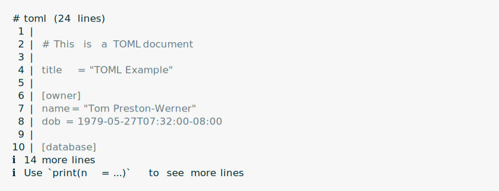
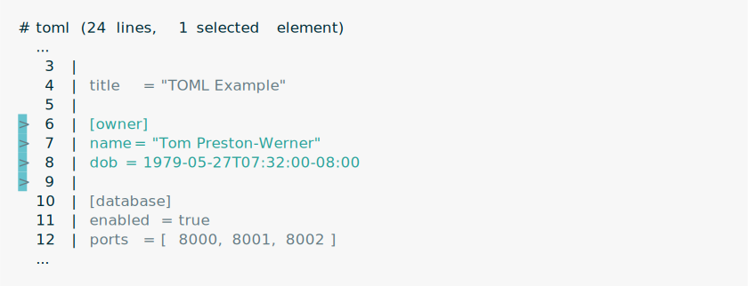
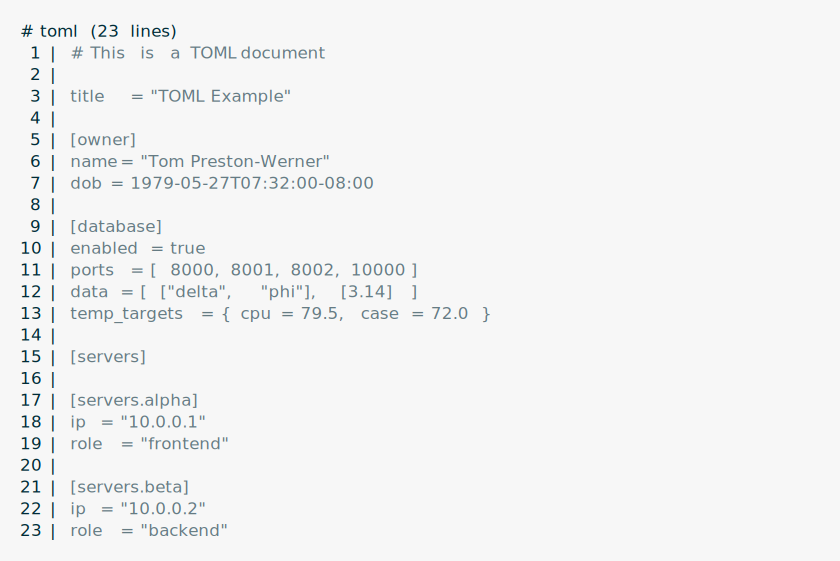
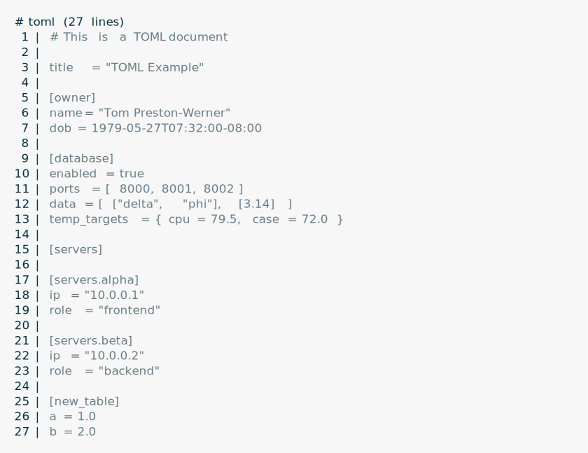
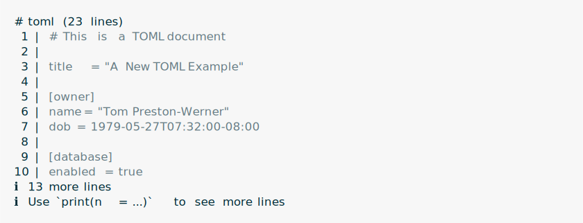
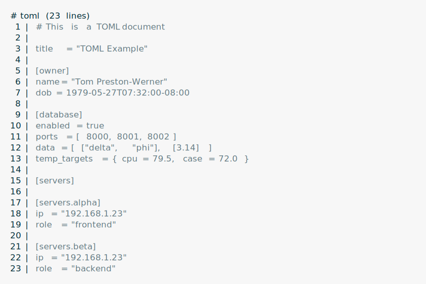

<!-- README.md is generated from README.Rmd. Please edit that file -->

# tstoml

<!-- badges: start -->


[](https://github.com/gaborcsardi/tstoml/actions/workflows/R-CMD-check.yaml)
[](https://app.codecov.io/gh/gaborcsardi/tstoml)
<!-- badges: end -->

Extract and manipulate parts of TOML files without touching the
formatting and comments in other parts.

## Installation

You can install the development version of tstoml from
[GitHub](https://github.com/) with:

``` r
# install.packages("pak")
pak::pak("gaborcsardi/tstoml")
```

## Documentation

See at
[`https://gaborcsardi.github.io/tstoml/`](https://gaborcsardi.github.io/tstoml/reference/index.html/)
and also in the installed package: `help(package = "tstoml")`.

## Quickstart

### Create a tstoml object

Create a tstoml object from a string:

``` r
txt <- r"(
# This is a TOML document

title = "TOML Example"

[owner]
name = "Tom Preston-Werner"
dob = 1979-05-27T07:32:00-08:00

[database]
enabled = true
ports = [ 8000, 8001, 8002 ]
data = [ ["delta", "phi"], [3.14] ]
temp_targets = { cpu = 79.5, case = 72.0 }

[servers]

[servers.alpha]
ip = "10.0.0.1"
role = "frontend"

[servers.beta]
ip = "10.0.0.2"
role = "backend"
)"
toml <- ts_parse_toml(text = txt)
```

Pretty print a tstoml object:

``` r
toml
```

<picture>
<source media="(prefers-color-scheme: dark)" srcset="man/figures/print-toml-dark.svg">
 </picture>

### Select elements in a tstoml object

``` r
ts_tree_select(toml, "owner")
```

<picture>
<source media="(prefers-color-scheme: dark)" srcset="man/figures/select-table-dark.svg">
 </picture>

Select element(s) inside elements:

``` r
ts_tree_select(toml, "owner", "name")
```

<picture>
<source media="(prefers-color-scheme: dark)" srcset="man/figures/select-select-dark.svg">
 </picture>

Select element(s) of an array:

``` r
ts_tree_select(toml, "database", "ports", 1:2)
```

<picture>
<source media="(prefers-color-scheme: dark)" srcset="man/figures/select-array-dark.svg">
 </picture>

Select multiple keys from a table:

``` r
ts_tree_select(toml, "owner", c("name", "dob"))
```

<picture>
<source media="(prefers-color-scheme: dark)" srcset="man/figures/select-multiple-dark.svg">
 </picture>

### Delete elements

Delete selected elements:

``` r
ts_tree_select(toml, "owner", "name") |> ts_tree_delete()
```

<picture>
<source media="(prefers-color-scheme: dark)" srcset="man/figures/delete-elements-dark.svg">
 </picture>

### Insert elements

Insert a key-value pair into the document:

``` r
ts_tree_insert(toml, key = "new_key", "new_value")
```

<picture>
<source media="(prefers-color-scheme: dark)" srcset="man/figures/insert-pair-document-dark.svg">
 </picture>

Insert a key-value pair into a table:

``` r
ts_tree_select(toml, "owner") |> ts_tree_insert(key = "dpt", "Engineering")
```

<picture>
<source media="(prefers-color-scheme: dark)" srcset="man/figures/insert-pair-table-dark.svg">
 </picture>

Insert an element into an array:

``` r
ts_tree_select(toml, "database", "ports") |>
  ts_tree_insert(10000L) |>
  print(n = 100)
```

<picture>
<source media="(prefers-color-scheme: dark)" srcset="man/figures/insert-element-array-dark.svg">
 </picture>

Insert a new table into the document:

``` r
ts_tree_insert(toml, key = "new_table", list(a = 1, b = 2)) |>
  print(n = 100)
```

<picture>
<source media="(prefers-color-scheme: dark)" srcset="man/figures/insert-table-document-dark.svg">
 </picture>

Insert a new array of tables into the document:

``` r
ts_tree_insert(toml, key = "new_aot",
  list(list(x = 1), list(x = 2))) |>
  print(n = 100)
```

<picture>
<source media="(prefers-color-scheme: dark)" srcset="man/figures/insert-aot-document-dark.svg">
 </picture>

### Update elements

Update an existing element:

``` r
ts_tree_select(toml, "title") |> ts_tree_update("A New TOML Example")
```

<picture>
<source media="(prefers-color-scheme: dark)" srcset="man/figures/update-element-dark.svg">
 </picture>

Update multiple emements at once:

``` r
ts_tree_select(toml, "servers", c("alpha", "beta"), "ip") |>
  ts_tree_update("192.168.1.23") |>
  print(n = 100)
```

<picture>
<source media="(prefers-color-scheme: dark)" srcset="man/figures/update-multiple-dark.svg">
 </picture>

# License

MIT © Posit Software, PBC
